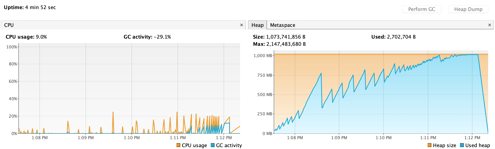

# Сравнение GC

## Тестовый класс
LeakingClass делает следующее:
 1. Создаёт 40000 объектов Bullets
 2. Забывает о половине из них через 0.5 секунд
 3. Сохраняет оставшиеся (20000) в массиве, что вызывает "утечку памяти"
 4. Повторяет в цикле    

Размер хипа 1Gb.
Параметры запуска, исключая сам GC:
```java
 -Xms1024m -Xmx1024m -verbose:gc -XX:+PrintGCDetails -XX:-PrintGCTimeStamps -XX:+HeapDumpOnOutOfMemoryError -XX:HeapDumpPath=./logs/dump -XX:+DisableExplicitGC -XX:+PrintGCApplicationStoppedTime -XX:+PrintGCApplicationConcurrentTime -XX:+PrintGCDateStamps -Xloggc:gclog.log -XX:+UseGCLogFileRotation -XX:NumberOfGCLogFiles=5 -XX:GCLogFileSize=2000k
``` 
Я пронал по два запуска с каждым из следующих сборщиков: ParallelGC, CMS и G1.  
Примеры логов сборщиков можно найти в папке gcLogs.

## Данные Parallel GC
Оба прогона заняли около 4 минут и 44-45 секунд.


Оба раза программа успела создать 15240000 - 15280000 Bullets (+x, где x < 40000).
Это означает, что 7620000 - 7640000 Bullets были в памяти и ещё меньше 40000 было сгенерировано на момент падения.

Общее время, на которое приложение было остановлено всеми сборками: 92.41 секунды.  
Общее время, на которое приложение было остановлено ParallelGC: 1.63 секунды.  
Общее время, на которое приложение было остановлено Full GC: 90.64 секунды.  
Общее время, на которое приложение было остановлено VM overhead operations: 0.14 секунды.

Throughput = 67.45%.  
Количество full GC остановок = 52.  
Количество GC остановок = 20.  
Средняя продолжительность gc паузы = 0.08166.  
Min/max продолжительность gc паузы 0.04413/0.15498s.

## Данные CMS
Оба прогона заняли около 4 минут и 13-14 секунд.


Оба раза программа успела создать 18440000 Bullets (+x, где x < 40000).
Это означает, что 9220000 Bullets были в памяти и ещё меньше 40000 было сгенерировано на момент падения.

Общее время, на которое приложение было остановлено всеми сборками: 23.99 секунды.  
Общее время, на которое приложение было остановлено CMS GC: 4.91 секунды.  
Общее время, на которое приложение было остановлено Full GC: 17.11 секунды.  
Общее время, на которое приложение было остановлено VM overhead operations: 1.97865 секунды.

Throughput = 90.52%.  
Количество full GC остановок = 11.  
Количество GC остановок = 69.  
Средняя продолжительность gc паузы = 0.07109.  
Min/max продолжительность gc паузы = 0.00468/0.16058s.  

## Данные G1
Оба прогона заняли около 4 минут и 52-58 секунд.


Оба раза программа успела создать 19480000 Bullets (+x, где x < 40000).
Это означает, что 9740000 Bullets были в памяти и ещё меньше 40000 было сгенерировано на момент падения.

Общее время, на которое приложение было остановлено всеми сборками: 59 секунд.  
Общее время, на которое приложение было остановлено CMS GC: 3.26 секунды.  
Общее время, на которое приложение было остановлено Full GC: 48.55 секунды.  
Общее время, на которое приложение было остановлено VM overhead operations: 7.18411 секунды.  

Throughput = 80.17%.  
Количество full GC остановок = 31.  
Количество GC остановок = 119.  
Средняя продолжительность gc паузы = 0.02742.  
Min/max продолжительность gc паузы 0.00068/0.21177s.  

## Сравнение

1. С точки зрения загрузки CPU нет большой разницы между CMS и G1:
в обоих случаях GC редко потреблял больше 10% и такая нагрузка проявлялась только, когды приложение начало
приближаться к пределу своей памяти; однако, CMS работал 50 секунд совместно с приложением (против 7.2 секунд у G1), что
подразумевает больший расход CPU ресурсов, пока программа работала.  
Parallel GC потреблял CPU только во воремя пауз, но во время сборок выедал весь CPU (80%-90%), что может создавать проблемы для 
других приложений на той же машине.

2. С точки зрения испольщования хипа, мы видим, что G1 продержался ощутимо дольше остальных и смог сохарнить на ~5% 
больше Bullets, чем CMS и на ~28% больше, чем parallel GC. Скорее всего, благодаря динамическом уменьшению памяти, 
выделенной под young generation. Но он работал менее эффективно, чем CMS, так как прирост в 5% памяти дался ему за счёт
увеличения общего времени работы на 16%.  
Не уверен, считать ли это плюсом или минусом. Если важно иметь гарантированное время отклика - то это, скорее минус, 
если важнее "живучесть", то плюс.
Также ParallelGC в момент падения утилизировал лишь 81% хипа, CMS и G1 приблизились к 100%.

3. G1 имеет самые короткие средние и минимальные GC паузы, но и самые долгие большие (когда находился близко к пределу),
что озаначает лучшее гарантированное время отклика приложения. На втором месте CMS, на третьем - Parallel GC, но 
количество пауз в G1 самое большое, потом CMS, потом Parallel GC. 
но стоит отметить, что G1 потратил намного больше времени на overhead VM operations, но, возможно, это всё благодаря 
последним тяжёлым секундам работы.  
Приложение с CMS GC упало быстрее всего, после достижения предела памяти (меньше всех висело в последней GC паузе). 

4. G1 имеет более хаотичное поведение, он может динамически менять размер частей хипа, исхордя из текущих потребностей. 
CMS и Parallel GC имеют больее простое предсказуемое поведение. Parallel GC стоит использовать, если к приложению нету 
строгих требований по времени отклика, если нет большой конкуренции за CPU. В противном случае, G1 и CMS - лучший выбор.

